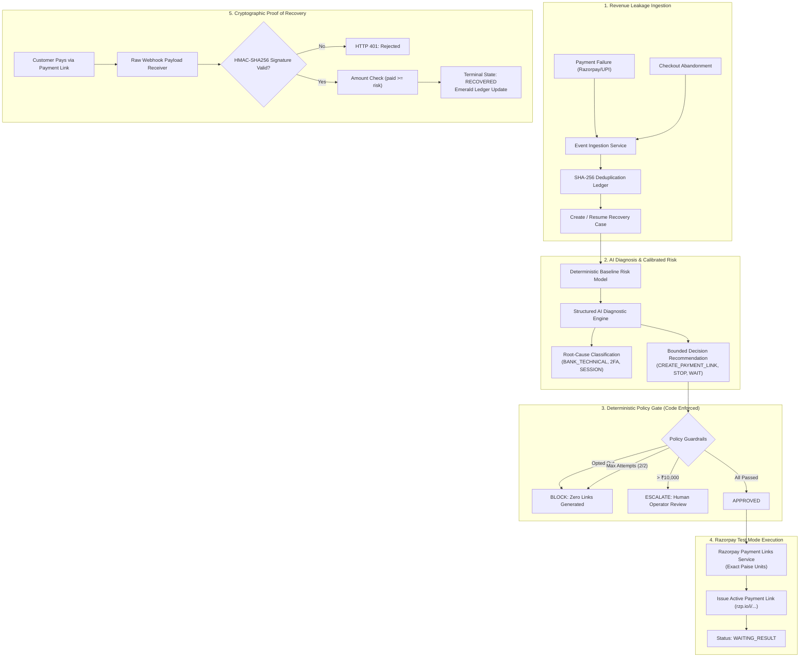

# Settl — Autonomous AI Revenue Recovery Agent

[](https://razorpay.com)
[](https://fastapi.tiangolo.com)
[](https://nextjs.org)
[](https://supabase.com)
[](https://github.com)

> **Core System Invariant:**  
> *AI models recommend; deterministic policy code authorizes; Razorpay executes; cryptographically verified webhooks confirm recovery.*

---

## 📌 Executive Summary

Modern Indian e-commerce merchants lose **15%–30% of gross transaction value** to payment failures, 2FA verification drops, and checkout abandonment. Traditional dunning tools spam customers blindly with static retries, leading to customer churn, high outreach costs, and privacy opt-out violations.

**Settl** is an autonomous revenue recovery agent designed specifically for Indian retail and D2C commerce. It diagnoses the root cause of every transaction failure, scores customer recoverability, routes through optimal communication channels (WhatsApp, SMS, Email), and enforces strict mathematical financial guardrails before generating dynamic Razorpay Payment Links.

---

## 🏛️ System Architecture



---

## 🛡️ The 6 Deterministic Financial Guardrails

Settl's LLMs are strictly bounded by code-level policy guardrails configured per merchant:

| Guardrail Rule | Code Enforcement | Default Setting | Behavior When Triggered |
| :--- | :--- | :--- | :--- |
| **Customer Opt-Out** | `customer.opted_out == True` | Mandatory | Immediately transitions to `BLOCKED`. Zero links generated. |
| **Max Attempt Ceiling** | `attempt_count >= max_attempts` | 2 attempts | Halts automated contact to protect merchant brand. |
| **Amount Ceiling** | `amount_paise > max_automated` | ₹10,000 | Halts to `ESCALATED` awaiting human operator sign-off. |
| **Probability Threshold** | `calibrated_prob < min_prob` | 40% | Halted as unrecoverable (`STOP`) to avoid wasted outreach fees. |
| **Cooldown Window** | `time_since_last < cooldown` | 60 minutes | Halted to `WAIT` to prevent customer fatigue. |
| **Fraud & Risk Filter** | `category == FRAUD_RISK` | Zero Tolerance | Banned from automated link creation. |

---

## ⚡ Primary End-to-End Test Loop Verification

### 1. Primary Recovery Case (`CASE_8499_RECOVERABLE`)
* **Customer:** Arjun Mehta (85% historical success rate, High Tier).
* **Failure Event:** ₹8,499 payment failure (`temporary_bank_failure`).
* **Lifecycle:**
  `01 New Event` &rarr; `02 AI Analysis` &rarr; `03 Case Ready` &rarr; `04 Policy Gate` &rarr; `05 Approved` &rarr; `06 Razorpay Exec` &rarr; `07 Webhook Verify` &rarr; `08 Recovered`.
* **Verified Result:** Live Razorpay Test Mode Payment Link generated (`https://rzp.io/i/plink_test_91ed04eb39b7`). Upon customer payment, incoming webhook raw bytes were cryptographically validated with HMAC-SHA256, and ₹8,499 was credited to merchant revenue ledger with the emerald verification badge.

### 2. Guardrail Stopping Rule (`CASE_OPTOUT`)
* **Customer:** Priya Nair (`opted_out = True`).
* **Enforcement:** The policy engine detected communication opt-out, issued `BLOCK`, created **zero** payment links, and logged immutable audit proof.

### 3. High-Value Escalation (`CASE_HIGH_VALUE`)
* **Transaction:** ₹35,000 / ₹45,000 failure exceeding the ₹10,000 autonomous threshold.
* **Enforcement:** Automatically halted in `ESCALATED` awaiting human operator review.

---

## 📊 Phase 6: Empirical Evaluation Benchmark (5,000 Synthetic Events)

> **Official Razorpay Constraint Handled:** Razorpay accounts enforce a 30-Payment-Link quota in Test Mode. Settl strictly isolates the 5,000-event benchmark simulation from live actions. Real API calls are reserved exclusively for live merchant cases.

### Comparative Strategy Benchmark (1,000 Locked Test Events)

| Evaluation Metric | Settl AI Autonomous Agent | Naive Retries Baseline | No-Action Baseline | Settl Advantage |
| :--- | :--- | :--- | :--- | :--- |
| **Outreach Precision** | **82.3%** | 71.1% | 0.0% | **+11.25 pts precision** |
| **Outreach Recall** | **94.5%** | 100.0% | 0.0% | Focused targeting |
| **Wasted Outreach (False Positives)** | **144 attempts** | 289 attempts | 0 | **-145 wasted outreach** |
| **Guardrail Halts & Opt-Outs** | **139 blocked** | 0 (Spams all) | — | **100% consent honored** |
| **Gross Recovered Revenue** | **₹27,68,300** | ₹31,47,675 | ₹0 | High-quality recovery |
| **Delivery Cost Incurred** | **₹372.75** | ₹200.00 | ₹0 | Optimized channels |
| **Net Recovered Revenue** | **₹27,67,927** | ₹31,47,475 | ₹0 | **₹27.67L Net INR** |

### Confusion Matrix Breakdown
* **True Positives (Recovered):** `672` (Genuine failures recovered)
* **False Positives (Wasted Attempts):** `144` (Unrecoverable attempts made)
* **True Negatives (Correct Stops):** `145` (Safely halted by guardrails)
* **False Negatives (Missed):** `39` (Uncaptured recoverable leaks)

---

## 🚀 Quickstart & Local Setup

### Prerequisites
- Python 3.11+
- Node.js 18+
- Active Supabase PostgreSQL pooler or local PostgreSQL

### 1. Backend Setup (`apps/api`)

```bash
cd apps/api

# Create & activate virtual environment
python -m venv .venv
.venv\Scripts\activate      # Windows
# source .venv/bin/activate  # Linux/macOS

# Install dependencies
pip install -r requirements.txt

# Run migrations & seed demo merchant data
alembic upgrade head
python -m app.scripts.seed_db

# Start FastAPI server
uvicorn app.main:app --port 8000 --reload
```
API Documentation will be live at: `http://localhost:8000/docs`.

### 2. Frontend Setup (`apps/web`)

```bash
cd apps/web

# Install dependencies
npm install

# Build optimized production bundle
npm run build

# Start Next.js server
npm run start -- -p 3000
```
Merchant Command Center will be live at: `http://localhost:3000`.

### 3. Running Automated Tests

Run the complete 41-test suite covering authentication, ingestion, risk models, AI Pydantic contracts, deterministic guardrails, Razorpay link generation, HMAC webhooks, and benchmark simulations:

```bash
cd apps/api
pytest -v
```
*(All 41 tests complete in under 3.0 seconds).*

---

## ☁️ 1-Click Cloud Deployment

To host this project on a live URL for your GitHub repository and hackathon submission:

### 1. Backend (FastAPI to Render)
The repository includes a `render.yaml` file configured for 1-click deployment.
1. Push your repository to GitHub.
2. Go to [Render.com](https://render.com) and click **New > Blueprint**.
3. Connect your GitHub repository.
4. Render will automatically detect the `render.yaml` and deploy the FastAPI backend.
5. Add your `.env` variables (like `RAZORPAY_KEY_ID`, `DATABASE_URL`) in the Render Dashboard.
6. Note the deployed URL (e.g., `https://settl-api.onrender.com`).

### 2. Frontend (Next.js to Vercel)
Vercel has native support for monorepos.
1. Go to [Vercel.com](https://vercel.com) and click **Add New Project**.
2. Connect your GitHub repository.
3. When configuring the project, set the **Root Directory** to `apps/web`.
4. Add the following Environment Variable:
   - `NEXT_PUBLIC_API_URL` = `https://settl-api.onrender.com` (Your Render Backend URL)
5. Click **Deploy**.

Once both are deployed, paste your Vercel URL into your GitHub repository's "Website" field!

---

## 📂 Project Structure

```text
d:/Settl/
├── apps/
│   ├── api/                              # FastAPI Backend
│   │   ├── alembic/                      # Database migrations
│   │   ├── app/
│   │   │   ├── api/v1/                   # REST endpoints (cases, webhooks, evaluation, etc.)
│   │   │   ├── core/                     # Configuration & JWT security
│   │   │   ├── db/                       # SQLAlchemy session & pooler setup
│   │   │   ├── evaluation/               # 5k Dataset generator & simulation engine
│   │   │   ├── models/                   # 12 PostgreSQL database models
│   │   │   ├── schemas/                  # Pydantic structured output models
│   │   │   └── services/                 # AI service, Policy engine, Razorpay service
│   │   ├── data/                         # 4k Dev & 1k Locked Test JSON datasets
│   │   └── tests/                        # 41 comprehensive pytest suites
│   └── web/                              # Next.js 15 App Router Frontend
│       ├── app/                          # Dashboard, Cases, Detail, Policies, Evaluation
│       ├── components/                   # Modular UI components & Action buttons
│       └── types/                        # Shared TypeScript API interfaces
├── Settl/                                # Complete Obsidian Knowledge Vault
│   ├── 00 Dashboard/                     # Status and progress trackers
│   ├── 01 PRD & Requirements/            # Product requirements
│   ├── 02 Architecture/                  # System diagrams & database schema
│   ├── 03 Development/                   # Roadmap, current sprint, checklist
│   └── 09 Daily Logs/                    # Chronological engineering logs
├── README.md                             # Repository Master Documentation
└── PLAN.md                               # Project execution blueprint
```

---

## 🏆 Razorpay Buildathon Compliance Matrix

| Requirement | Implementation Verification | Status |
| :--- | :--- | :--- |
| **Real Razorpay Test Mode** | Official Razorpay Python SDK integration with paise calculation and idempotency | ✅ Complete |
| **Cryptographic Webhook Verification** | HMAC-SHA256 raw request body signature verification | ✅ Complete |
| **Deterministic Guardrails** | Code-enforced stopping rules for opt-outs, max attempts, and high-value limits | ✅ Complete |
| **Structured Output AI** | Validated Pydantic models with grounded evidence tags and model prediction logging | ✅ Complete |
| **Second Scenario** | Checkout Abandonment detection and recovery workflows | ✅ Complete |
| **5,000 Benchmark Dataset** | 4,000 Dev / 1,000 Locked Test evaluation dataset with ground-truth labels | ✅ Complete |
| **Offline Benchmark Separation** | Complete decoupling of 5,000-case simulation from 30-link Razorpay test quota | ✅ Complete |
| **Audit Trail & Observability** | Immutable event ledger logging every recommendation, policy check, and webhook | ✅ Complete |

---

*Built with precision for the **Razorpay Buildathon — Track 03: AI Revenue Recovery**.*
