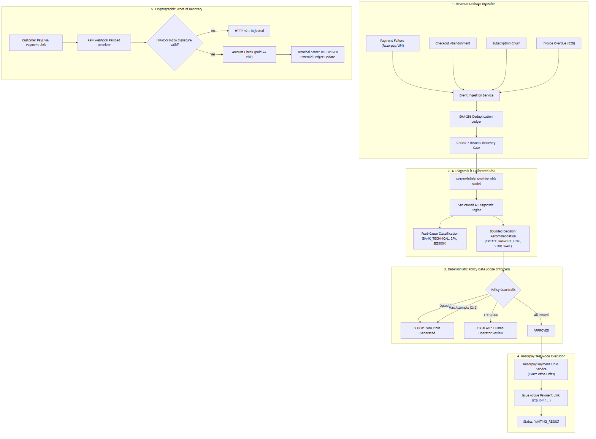

# Settl — Autonomous AI Revenue Recovery Agent

[](https://razorpay.com)
[](https://fastapi.tiangolo.com)
[](https://nextjs.org)
[](https://supabase.com)
[](https://github.com)

> **Core System Invariant:**  
> *AI models recommend; deterministic policy code authorizes; Razorpay executes; cryptographically verified webhooks confirm recovery.*

---

## 📌 Executive Summary

Modern Indian e-commerce merchants lose **15%–30% of gross transaction value** to payment failures, 2FA verification drops, and checkout abandonment. Traditional dunning tools spam customers blindly with static retries, leading to customer churn, high outreach costs, and privacy opt-out violations.

**Settl** is an autonomous revenue recovery agent designed for Indian retail and D2C commerce. It diagnoses the root cause of every transaction failure, scores customer recoverability, routes through optimal communication channels (WhatsApp, SMS, Email), and enforces strict mathematical financial guardrails before generating dynamic Razorpay Payment Links.

---

## 🏛️ System Architecture



---

## 🛡️ The 6 Deterministic Financial Guardrails

Settl's LLMs are strictly bounded by code-level policy guardrails configured per merchant:

| Guardrail Rule | Code Enforcement | Default Setting | Behavior When Triggered |
| :--- | :--- | :--- | :--- |
| **Customer Opt-Out** | `customer.opted_out == True` | Mandatory | Immediately transitions to `BLOCKED`. Zero links generated. |
| **Max Attempt Ceiling** | `attempt_count >= max_attempts` | 2 attempts | Halts automated contact to protect merchant brand. |
| **Amount Ceiling** | `amount_paise > max_automated` | ₹10,000 | Halts to `ESCALATED` awaiting human operator sign-off. |
| **Probability Threshold** | `calibrated_prob < min_prob` | 40% | Halted as unrecoverable (`STOP`) to avoid wasted outreach fees. |
| **Cooldown Window** | `time_since_last < cooldown` | 60 minutes | Halted to `WAIT` to prevent customer fatigue. |
| **Fraud & Risk Filter** | `category == FRAUD_RISK` | Zero Tolerance | Banned from automated link creation. |

---

## ⚡ Recovery Case Lifecycle (6 Supported Scenarios)

Settl handles six distinct recovery scenarios end-to-end:

| Case | Scenario | Lifecycle | Razorpay Integration |
| :--- | :--- | :--- | :--- |
| **Case 1** | Payment Failure Recovery | Event → AI Analysis → Policy Gate → Razorpay Payment Link → Webhook Verification → Recovered | Payment Links API |
| **Case 2** | Checkout Abandonment | Session Timeout Detection → Recovery Link Generation → Customer Checkout Completion | Payment Links API |
| **Case 3** | Subscription Churn Prevention | `subscription.pending` Webhook → Churn Risk Analysis → Recovery Payment Link → `subscription.charged` Confirmation | Subscriptions API |
| **Case 4** | Invoice Overdue (B2B) | `INVOICE_OVERDUE` Event → Aging Analysis → Payment Link / Escalation | Payment Links API |
| **Case 5** | Promise-to-Pay Tracking | Manual / Automated Promise Recording → Lifecycle Worker → Overdue Detection → Follow-up | Promise Worker |
| **Case 6** | Guardrail Enforcement | Opt-out / High-value / Max-attempts → `BLOCKED` or `ESCALATED` with zero links generated | Policy Engine |

---

## 📊 Empirical Evaluation Benchmark (5,000 Synthetic Events)

> **Razorpay Constraint Handled:** Razorpay accounts enforce a 30-Payment-Link quota in Test Mode. Settl strictly isolates the 5,000-event benchmark simulation from live actions.

### Comparative Strategy Benchmark (1,000 Locked Test Events)

| Evaluation Metric | Settl AI Agent | Naive Retries Baseline | No-Action Baseline | Settl Advantage |
| :--- | :--- | :--- | :--- | :--- |
| **Outreach Precision** | **82.3%** | 71.1% | 0.0% | **+11.25 pts precision** |
| **Outreach Recall** | **94.5%** | 100.0% | 0.0% | Focused targeting |
| **Wasted Outreach** | **144 attempts** | 289 attempts | 0 | **-145 wasted outreach** |
| **Guardrail Halts** | **139 blocked** | 0 (Spams all) | — | **100% consent honored** |
| **Net Recovered Revenue** | **₹27,67,927** | ₹31,47,475 | ₹0 | **₹27.67L Net INR** |

---

## 🚀 Quickstart & Local Setup

### Prerequisites
- Python 3.11+
- Node.js 18+
- Active Supabase PostgreSQL pooler or local PostgreSQL / SQLite

### 1. Clone & Configure Environment

```bash
git clone https://github.com/SaishNehe05/Settl.git
cd Settl
cp .env.example .env
# Edit .env with your Razorpay, Supabase, and LLM credentials
```

### 2. Backend Setup (`apps/api`)

```bash
cd apps/api

# Create & activate virtual environment
python -m venv .venv
.venv\Scripts\activate      # Windows
# source .venv/bin/activate  # Linux/macOS

# Install dependencies
pip install -r requirements.txt

# Run database migrations & seed demo merchant data
alembic upgrade head
python -m app.scripts.seed_db

# Start FastAPI server
uvicorn app.main:app --port 8000 --reload
```

API documentation → `http://localhost:8000/docs`

### 3. Frontend Setup (`apps/web`)

```bash
cd apps/web
npm install
npm run dev
```

Merchant Command Center → `http://localhost:3000`

### 4. Demo Store (Optional)

```bash
cd apps/demo-store
# Open index.html in browser — simulates customer checkout abandonment
```

### 5. One-Command Start (Both Servers)

```bash
python scripts/run_dev.py
```

### 6. Running Automated Tests

```bash
cd apps/api
pytest -v
```

---

## 📂 Project Structure

```text
Settl/
├── apps/
│   ├── api/                                  # FastAPI Backend (Python)
│   │   ├── alembic/                          # Database migrations
│   │   ├── app/
│   │   │   ├── agents/                       # Deterministic risk engine
│   │   │   │   └── risk_engine.py            # Feature extraction & probability calibration
│   │   │   ├── api/v1/                       # REST API endpoints
│   │   │   │   ├── auth.py                   # JWT authentication & registration
│   │   │   │   ├── cases.py                  # Recovery case CRUD & actions
│   │   │   │   ├── checkout.py               # Checkout session management
│   │   │   │   ├── dashboard.py              # KPI summary & analytics
│   │   │   │   ├── demo.py                   # Demo simulation endpoints
│   │   │   │   ├── evaluation.py             # Batch evaluation benchmark
│   │   │   │   ├── events.py                 # Revenue event ingestion
│   │   │   │   ├── policies.py               # Policy configuration
│   │   │   │   ├── receivables.py            # Receivables status tracking
│   │   │   │   └── webhooks.py               # Razorpay webhook receiver
│   │   │   ├── models/                       # 14 SQLAlchemy database models
│   │   │   ├── schemas/                      # Pydantic request/response schemas
│   │   │   ├── scripts/                      # DB seeding & eval dataset generation
│   │   │   └── services/                     # Core business logic
│   │   │       ├── ai_service.py             # LLM structured output integration
│   │   │       ├── audit_service.py          # Immutable audit trail
│   │   │       ├── auth_service.py           # JWT token management
│   │   │       ├── evaluation_service.py     # 5k benchmark simulation engine
│   │   │       ├── event_service.py          # Revenue event processing
│   │   │       ├── notification_service.py   # Multi-channel notification routing
│   │   │       ├── policy_service.py         # 6-rule deterministic guardrails
│   │   │       ├── promise_worker.py         # Promise-to-pay lifecycle worker
│   │   │       ├── razorpay_service.py       # Razorpay SDK integration
│   │   │       ├── recovery_service.py       # Recovery orchestration
│   │   │       ├── webhook_classifier.py     # Webhook event classification
│   │   │       ├── webhook_normalizer.py     # Payload normalization
│   │   │       ├── webhook_processor.py      # Webhook-to-case pipeline
│   │   │       └── webhook_worker.py         # Async webhook retry worker
│   │   ├── data/                             # Evaluation datasets (4k dev + 1k locked test)
│   │   └── tests/                            # 70 comprehensive pytest suites
│   │       ├── conftest.py                   # SQLite in-memory test fixtures
│   │       ├── test_ai_service.py            # LLM contract validation
│   │       ├── test_auth.py                  # Authentication & JWT tests
│   │       ├── test_case1_recovery.py        # Full payment recovery pipeline
│   │       ├── test_dashboard.py             # Dashboard API tests
│   │       ├── test_end_to_end_loop.py       # Complete E2E recovery loop
│   │       ├── test_event_service.py         # Event ingestion tests
│   │       ├── test_health.py                # Health check endpoint
│   │       ├── test_policy_engine.py         # Guardrail enforcement tests
│   │       ├── test_razorpay_service.py      # Razorpay integration tests
│   │       ├── test_risk_engine.py           # Risk model accuracy tests
│   │       ├── test_state_machine.py         # Case state transition tests
│   │       ├── test_webhook_integration.py   # Webhook pipeline tests
│   │       └── test_webhooks.py              # Webhook signature verification
│   ├── demo-store/                           # Customer-facing demo checkout page
│   │   ├── index.html                        # HTML checkout simulator
│   │   ├── app.js                            # Checkout & Razorpay integration
│   │   └── style.css                         # Demo store styling
│   └── web/                                  # Next.js 16 Merchant Command Center
│       ├── app/
│       │   ├── page.tsx                      # Executive overview dashboard
│       │   ├── cases/page.tsx                # Recovery queue with filters
│       │   ├── cases/[id]/page.tsx           # Case detail command center
│       │   ├── evaluation/page.tsx           # Batch evaluation & benchmarks
│       │   ├── login/page.tsx                # Authentication (login/register)
│       │   └── policies/page.tsx             # Policy & guardrail configuration
│       ├── components/
│       │   ├── auth/                         # Auth provider & guards
│       │   ├── cases/                        # Case actions, status badges, manual creation
│       │   └── layout/                       # Navbar, sidebar, client layout shell
│       ├── lib/                              # API client, auth helpers, utilities
│       └── types/                            # TypeScript API type definitions
├── scripts/
│   └── run_dev.py                            # One-command dev environment launcher
├── .env.example                              # Environment variable template
├── render.yaml                               # Render.com 1-click deployment config
└── README.md                                 # This file
```

---

## ☁️ Cloud Deployment

### Backend → Render

The repository includes a `render.yaml` for 1-click deployment:
1. Push to GitHub → Go to [render.com](https://render.com) → **New > Blueprint**
2. Connect your repo — Render auto-detects the config
3. Add environment variables (`DATABASE_URL`, `RAZORPAY_KEY_ID`, `RAZORPAY_KEY_SECRET`, etc.)

### Frontend → Vercel

1. Go to [vercel.com](https://vercel.com) → **Add New Project**
2. Connect your GitHub repo → Set **Root Directory** to `apps/web`
3. Add `NEXT_PUBLIC_API_URL` pointing to your Render backend URL
4. Deploy

---

## 🏆 Razorpay Buildathon Compliance Matrix

| Requirement | Implementation | Status |
| :--- | :--- | :--- |
| **Real Razorpay Test Mode** | Official Python SDK with paise calculation and idempotency | ✅ |
| **Cryptographic Webhook Verification** | HMAC-SHA256 raw request body signature verification | ✅ |
| **Deterministic Guardrails** | 6 code-enforced stopping rules (opt-out, max attempts, amount ceiling, probability, cooldown, fraud) | ✅ |
| **Structured Output AI** | Pydantic-validated LLM responses with grounded evidence tags | ✅ |
| **Multiple Recovery Scenarios** | 6 distinct cases (payment failure, checkout abandonment, subscription churn, invoice overdue, promise-to-pay, guardrail enforcement) | ✅ |
| **5,000 Benchmark Dataset** | 4,000 dev + 1,000 locked test evaluation with ground-truth labels | ✅ |
| **Offline Benchmark Separation** | Complete decoupling from Razorpay 30-link test quota | ✅ |
| **Audit Trail & Observability** | Immutable append-only event ledger on every transition | ✅ |
| **Multi-Tenant Architecture** | JWT-authenticated merchant isolation with per-tenant data scoping | ✅ |
| **Comprehensive Test Suite** | 70 automated tests covering all services, APIs, and integrations | ✅ |

---

*Built for the **Razorpay Buildathon — Track 03: AI Revenue Recovery**.*
